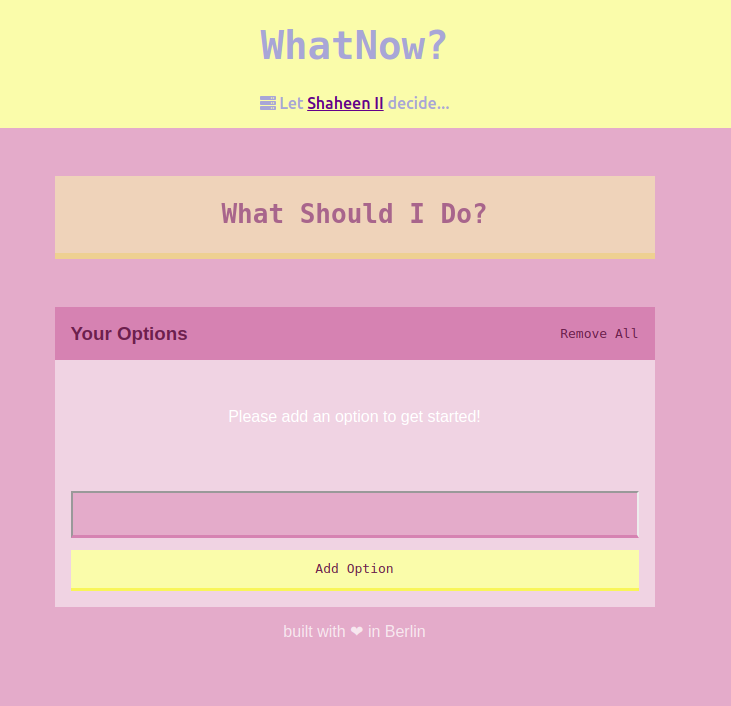

A classical to do application with a random task picker, for days when you're too lazy to decide, let the random world of bits and bytes do it for you. Built in React + Redux.

[Github](https://github.com/christiankopac/whatnow-app) + [Demo](http://sturdy-clock.surge.sh/)

